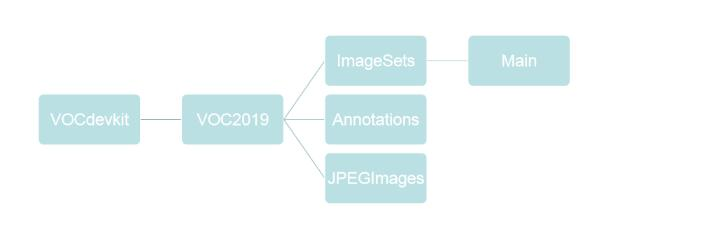

### Yolov3-tiny 训练方法

---

> 1. **准备数据**
> 2. **在scripts文件下新建文件**
> 3. **修改voc_label.py文件**
> 4. **修改cfg/voc.data、data/voc.names文件**
> 5. **修改yolov3-tiny.cfg文件**
> 6. **获取卷积核**
> 7. **训练**

---

---

> **在scripts新建的文件内容如下**：
>
> 

> ***Main里面放的是train.txt,val.txt两个文件。两个txt文件的内容是图片的名字(没有后缀的)***
>
> 
>
> >

---

---

> **voc_label.py文件修改内容如下：**
>
> > 1. ln7 -- set = [('2019','train'),('2019','val')]
> >
> >    
> >
> > 2. ln9 -- classes = ['']  （训练的类别名字）his
> >
> > 3. 最后一行: os.systen("cat 2019_train.txt 2019_val.txt > train.txt")
> >
> >    

---

---

> **cfg/voc.data文件修改内容如下：**
>
> > 1. train = 修改为2019_train.txt的路径
> >
> > 2. valid = 修改为2019_val.txt的路径
> >
> > 3. data/voc.names -->  ( voc.names存放的是你类别名字的一个文件 )
> >
> >    

---

---

> **cfg文件修改内容如下：**
>
> > 1. 
> >
> >    > **修改batch和subdivisions为上诉图片样子**
> >
> > 
> >
> > 2. 
> >
> >    > 1. **修改classes,classes为类别的个数**
> >    >2. **修改filters，公式为3*(5+classes)**
> >    > 3. 主要看**activation = linear** 附近的classes和filters。 tiny修改的有两次，可从后面找起
> >

---

---

#### 获取卷积层的权重(需要有yolov3-tiny.weights)

> 1.  ./darknet partial cfg/yolov3-tiny.cfg yolov3-tiny.weights yolov3-tiny.conv.15 15
> 2. wget https://pjreddie.com/media/files/darknet53.conv.74 
>    * 方法2是Imagenet上预先训练的权重，是目前能训练成功的一个卷积权重

---

---

#### 训练

> ./darknet detector train cfg/voc.data cfg/yolov3-tiny.cfg yolov3-tiny.conv.15 
>
> > 如果需要多个GPU在后面加 - gpus 0,1,2  --> 0,1,2代表GPU是序号

